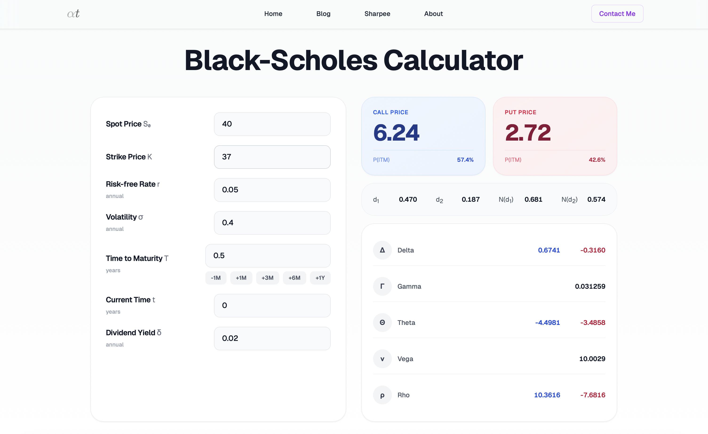

# Mathematical Finance 2

**Grade 30 *cum laude***

> **Disclaimer:** These are just my personal notes taken in class for the Mathematical Finance 2 course at Politecnico di Milano. They are shared here for reference, but may contain personal shorthand or focus on topics as they were presented during my specific semester.

---

## Contents

This repository contains:
1. **`Appunti.tex` / `Appunti.pdf`**: My comprehensive lecture notes for the entire course.
2. **`Formulario.tex` / `Formulario.pdf`**: A condensed cheat sheet with all the essential formulas needed for exercises and the exam.
3. **Black & Scholes Calculator**: A Python script to calculate options prices and their sensitivities (Greeks).

### Topics Covered in `Appunti.pdf` & `Formulario.pdf`
The notes and formula sheet briefly summarize the key mathematical tools and pricing models covered in the course:
* **Binomial Model**: Risk-neutral pricing, replicating portfolios, No-Arbitrage conditions, and the Cox-Ross-Rubinstein (CRR) parameterization.
* **Stochastic Calculus**: Brownian Motion properties, Geometric Brownian Motion (GBM), one-dimensional and multi-dimensional Itō's Lemma, and Martingale conditions.
* **Martingale Theory & Risk-Neutral Measures**: Martingale representation theorem, Girsanov theorem, changes of measure ($\mathbb{P}$ to $\mathbb{Q}$), and the Radon-Nikodym derivative.
* **Black & Scholes Model**: The fundamental PDE, pricing formulas for European Calls and Puts (including discrete and continuous dividends), and the computation of Greeks ($\Delta, \Gamma, \mathcal{V}, \Theta, \rho$).
* **Dividend Models**: Adaptations for both continuous dividend yields ($\delta$) and discrete cash dividends ($D$).
* **American Options & Optimal Stopping**: The optimal control problem, early exercise boundary, Snell envelope, and stopping times.
* **Hedging & Trading Strategies**: Put-Call Parity, and various combinations like Spreads (Bull/Bear/Butterfly) and Straddles/Strangles.
* **Meta Theorem**: Fundamental theorems linking No-Arbitrage to the existence of risk-neutral measures, and market completeness to the uniqueness of such measures.
* **Exotic Options**: Pricing formulas and definitions for Cash/Asset-or-Nothing, Chooser options, Asian, Lookback, and Barrier Options (In/Out Parity, Down/Up-and-In/Out).
* **Pure Currency Options**: Garman-Kohlhagen adaptations for FX markets.
* **Interest Rate Models**: Affine Term Structures (ATS) and specific short-rate models like Vasicek, Ho-Lee, and Hull-White, including bond option pricing.
* **Libor & Swap**: Forward rate modeling, Swaps valuation, and the Black-76 formula for Caplets and Swaptions.

---

## Black & Scholes Python Calculator

In the `black and scholes calculator/` directory, you will find `black_scholes.py`, a practical tool I built to calculate option theoretical prices and Greeks based on the Black-Scholes model.

**Features:**
* Computes both **European Call** and **European Put** prices simultaneously.
* Calculates all standard and derivative **Greeks**: Delta ($\Delta$), Gamma ($\Gamma$), Vega ($\mathcal{V}$), Theta ($\Theta$), and Rho ($\rho$).
* Automatically calculates intermediate values like $d_1$, $d_2$, and the normal CDF/PDF probabilities.
* Includes support for underlying assets paying a continuous dividend yield ($q$ or $\delta$).
* Calculates the risk-neutral probability of an option finishing *In-The-Money* (ITM).

**Usage:**
Modify the parameters at the bottom of the script (`s_0`, `sigma`, `r`, `K`, `T`, `delta`) and run the file using Python:
```bash
python black_scholes.py
```
It will output a neatly formatted console report detailing intermediate calculation steps, theoretical prices, and the Greeks for both call and put variations.

---

## Web Calculator 
If you prefer not to use the Python script, you can use my interactive **Web-based Black-Scholes Calculator**, which I built using the same underlying logic. 

**[Try the Web Calculator Here](https://www.albertotoia.com/bs-calc)**

